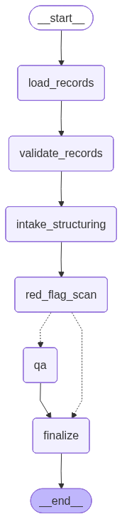

# MediMind

### Clinical Patient Intake & Medical QA Assistant

MediMind is an AI-powered **clinical patient intake assistant** designed to help doctors quickly understand complex patient records. It converts raw, unstructured medical documents into **clear, structured, doctor-ready summaries**, while also supporting **safe, document-grounded medical Q&A**.

Built for healthcare workflows where **accuracy, traceability, and transparency** are critical.

---

## Problem Statement

Doctors often receive:

* Long, unstructured patient reports
* Scanned discharge summaries
* Fragmented lab and imaging results

Reviewing these manually is:

* Time-consuming
* Error-prone
* Mentally exhausting in high-pressure environments

MediMind solves this by acting as a **clinical intake copilot**, ensuring that doctors see the **right information, in the right structure, without hallucinations**.

---

## Solution Overview

MediMind performs two core functions:

### 1️⃣ Clinical Intake Mode

* Reads raw patient records (TXT files)
* Generates a **structured clinical summary**
* Clearly marks missing or unclear information
* Surfaces red flags only if explicitly present in records

### 2️⃣ Medical Question Answering Mode

* Doctors can ask follow-up questions (e.g., medications, labs, procedures)
* Answers are **strictly grounded in uploaded patient data**
* If information is absent, the system explicitly says
  **“Not mentioned in records”**

---

## Why LangGraph?

Healthcare systems require **deterministic, auditable reasoning**, not black-box LLM calls.

MediMind uses **LangGraph** to explicitly separate clinical reasoning into clear stages:

### LangGraph Flow



### Graph Stages Explained

1. **Load Patient Records**
   Loads all uploaded patient documents

2. **Clinical Data Validation**
   Ensures records are readable and non-empty

3. **Structured Intake Generation**
   Converts raw text into a doctor-friendly clinical format

4. **Critical Risk / Red Flag Scan**
   Identifies explicitly mentioned high-risk findings

5. **Doctor Question Answering (Conditional Path)**
   Routes user queries differently from intake generation

6. **Doctor-Ready Summary Output**
   Produces final validated response

### Why This Matters

* Prevents hallucinations
* Enforces reasoning order
* Improves transparency and trust
* Enables explainability for medical use cases

---

## User Interface

* Clean and Ssmplistic UI
* Sidebar for uploading patient records
* Streaming responses for real-time feedback
* Sectioned clinical output for readability

Designed so doctors can **use it instantly without training**.

---

## Supported Input

* Plain text patient records (`.txt`)
* Multiple documents supported simultaneously
* Each document is tagged and traceable in context

> ⚠️ This demo uses text files for simplicity. The architecture supports future extension to PDFs, HL7, or EHR formats.

---

## Safety & Grounding Guarantees

MediMind is built with **medical safety constraints**:

* Uses **ONLY** uploaded patient records
* Never injects external medical knowledge
* Clearly marks missing information
* No treatment recommendations beyond documented data

This makes it suitable for **clinical decision support**, not diagnosis automation.

---

## Tech Stack

### Backend

* **FastAPI** – High-performance API server
* **LangGraph** – Multi-step agent orchestration
* **LangChain** – Prompt and LLM abstraction
* **Groq (LLaMA 3.1)** – Fast inference for low-latency responses

### Frontend

* **React (Vite)** – Modern UI framework
* **Streaming SSE** – Token-by-token output
* **Custom UI Components** – Sectioned medical summaries

---

## 🚀 How to Run Locally

### Backend

```bash
cd backend
python -m venv venv
source venv/bin/activate
pip install -r requirements.txt
uvicorn api:app --reload
```

### Frontend

```bash
cd frontend
npm install
npm run dev
```

Frontend runs at:

```
http://localhost:5173
```

Backend runs at:

```
http://127.0.0.1:8000
```

---

## Environment Variables

Create a `.env` file:

```env
GROQ_API_KEY=your_groq_api_key_here
```

---

## Sample Use Case

1. Upload a patient record (e.g., discharge summary)
2. MediMind auto-generates a structured clinical intake
3. Ask follow-up questions like:

   * “What medications is the patient on?”
   * “Any abnormal lab findings?”
   * “Were any procedures performed?”

All answers remain **strictly grounded** in the uploaded data.

---

## Future Enhancements

* PDF & scanned document support
* EHR / HL7 ingestion
* Red flag highlighting in UI
* Exportable clinical summaries (PDF)
* Multi-patient timeline view

---

## Built For Doctors. Designed For Trust.

MediMind is not just an AI chatbot —
it is a **clinical reasoning assistant** built with safety, clarity, and real-world healthcare workflows in mind.

---

